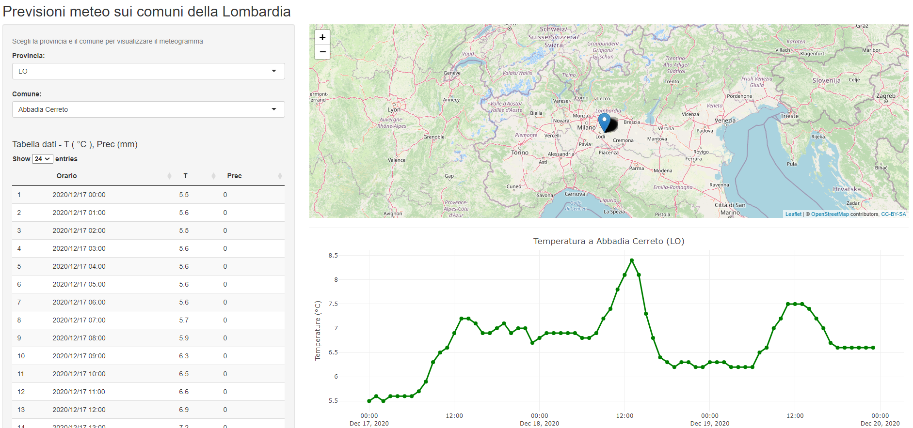

# SIMIF (Shiny Interface for Municipality Interactive Forecasts)
## Previsioni meteo a scala comunale sulla Lombardia by ShinyApp
### Introduzione
SIMIF è un applicativo in grado di restituire previsioni meteorologiche a 72h per qualsiasi comune della Lombardia. Al 20-11-2020 le variabili visualizzabili, a scadenza oraria, sono temperatura a 2m, precipitazione cumulata, nuvolosità (in ottavi), velocità e direzione del vento a 10m. I dati sono elaborazioni dal modello numerico COSMO 5M.

### La tecnologia
L'applicativo è costruito attraverso il pacchetto R denominato Shiny (https://shiny.rstudio.com/), il quale sfrutta l'interattività dei grafici del pacchetto PLOTLY (https://plotly.com/r/), già sviluppato anche per il linguaggio PYTHON.

### La struttura
L'architettura dell'app prevede l'utilizzo di un file NetCDF contenente tutte le variabili sopracitate e proveniente da elaborazioni utilizzate anche dall'applicativo CIUMBIA (https://github.com/ARPASMR/ciumbia), in seguito sono presenti istruzioni di interpolazione e creazione di un database, lo stesso che l'app di Shiny utilizza per funzionare.
Ulteriori dettagli sui "mattoni" che costutuiscono l'applicazione sono disponibili nel file caricato su questa repository: https://github.com/mazanetti/SIMIF/blob/main/Architettura_SIMIF.pdf

### Funzionamento da container
_In aggiornamento_

### Utilizzo dell'app
L'interfaccia si compone di un form di "ricerca comune" diviso per provincia e di 4 output in risposta alla selezione dell'utente.
Nel dettaglio:
- Una mappa per geolocalizzare il comune
- Tre grafici di previsione che mostrano: temperatura (° C), nuvolosità (ottavi), precipitazioni (mm), velocità e direzione del vento (m/s e gradi sessagesimali)
- Una tabella dati con temperatura e precipitazioni

La particolare caratteristica dei grafici è quella di essere "dinamici", ossia con possibilità di interagire con gli stessi attraverso selezioni, zoom etc...
Di seguito un esempio di come si presenta l'interfaccia grafica:
 

